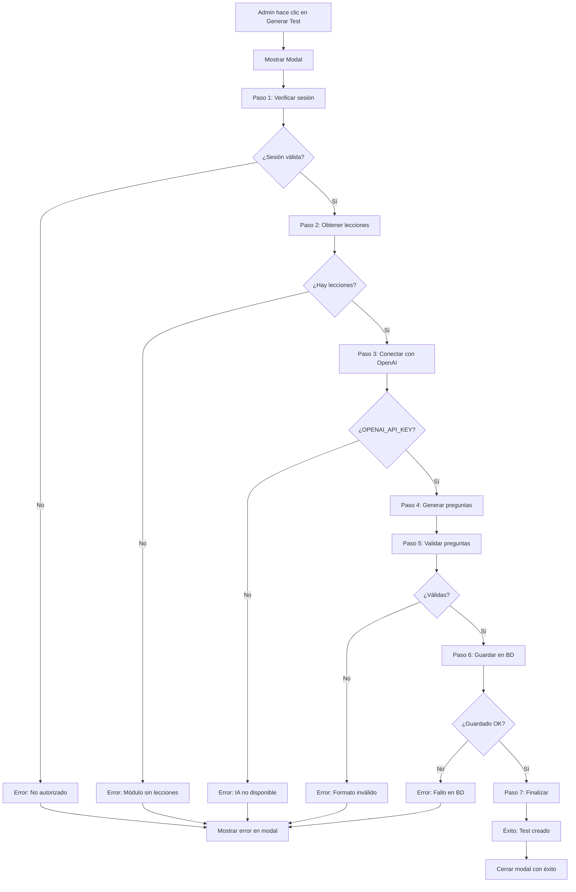

# 🔧 Resolución de Problemas: Generación de Tests

## 📋 Resumen

Este documento detalla los problemas encontrados durante la generación de tests de módulos y las soluciones implementadas.

---

## ❌ Problema Original

### Síntomas
- Error 500 al intentar generar el segundo test de un módulo
- Error 406 en queries a `module_tests`
- Mensaje genérico: "Error al guardar el test"
- No había visibilidad sobre qué estaba fallando

### Diagnóstico

Se identificaron **3 problemas principales**:

1. **Falta de `OPENAI_API_KEY`** en entorno de producción
2. **Uso de `.single()` en queries** que generaba error 406 cuando no había registros
3. **Falta de feedback visual** durante el proceso de generación

---

## ✅ Soluciones Implementadas

### 1. Modal de Progreso en Tiempo Real

**Problema**: El administrador no sabía qué estaba pasando durante la generación del test (que puede tardar hasta 30 segundos).

**Solución**: Se creó `TestGenerationModal.tsx` que muestra 7 pasos en tiempo real:

```typescript
const initialSteps: GenerationStep[] = [
  { id: '1', label: 'Verificando sesión', status: 'loading' },
  { id: '2', label: 'Obteniendo lecciones del módulo', status: 'pending' },
  { id: '3', label: 'Conectando con OpenAI', status: 'pending' },
  { id: '4', label: 'Generando preguntas con IA', status: 'pending' },
  { id: '5', label: 'Validando preguntas generadas', status: 'pending' },
  { id: '6', label: 'Guardando test en base de datos', status: 'pending' },
  { id: '7', label: 'Finalizando', status: 'pending' }
]
```

**Beneficios**:
- ✅ Saber en qué paso está el proceso
- ✅ Ver mensajes descriptivos de cada paso
- ✅ Identificar exactamente dónde falla si hay error
- ✅ Barra de progreso visual
- ✅ No se puede cerrar durante el proceso (evita interrupciones)

**Archivos modificados**:
- `components/ui/TestGenerationModal.tsx` (NUEVO)
- `components/admin/ModulesManager.tsx`
- `app/administrator/tests/page.tsx`

---

### 2. Corrección de Error 406 en Queries

**Problema**: Al usar `.single()` en Supabase, si no había registros devolvía error 406.

**Código problemático**:
```typescript
const { data, error } = await supabase
  .from('module_tests')
  .select('*')
  .eq('module_id', moduleId)
  .single() // ❌ Error 406 si no hay registros
```

**Solución**: Usar `.maybeSingle()` que devuelve `null` en lugar de error:

```typescript
const { data, error } = await supabase
  .from('module_tests')
  .select('*')
  .eq('module_id', moduleId)
  .maybeSingle() // ✅ Devuelve null si no hay registros

if (error) {
  if (error.code === 'PGRST116') return null
  console.error('Error obteniendo test del módulo:', error)
  return null
}
```

**Archivo modificado**:
- `lib/supabase/tests.ts` (funciones `getModuleTest` y `getModuleTestAdmin`)

---

### 3. Uso de Service Role Key para Evitar Problemas RLS

**Problema**: Las políticas RLS de Supabase podían bloquear la inserción/actualización de tests desde la API.

**Solución**: Usar `SUPABASE_SERVICE_ROLE_KEY` para operaciones administrativas:

```typescript
const supabaseUrl = process.env.NEXT_PUBLIC_SUPABASE_URL!
const supabaseKey = process.env.NEXT_PUBLIC_SUPABASE_ANON_KEY!
const serviceRoleKey = process.env.SUPABASE_SERVICE_ROLE_KEY

// Cliente normal para autenticación
const supabase = createClient(supabaseUrl, supabaseKey, {
  global: {
    headers: {
      Authorization: `Bearer ${token}`
    }
  }
})

// Cliente admin para operaciones de BD
const supabaseAdmin = serviceRoleKey
  ? createClient(supabaseUrl, serviceRoleKey)
  : supabase

// Usar supabaseAdmin para lecturas/escrituras
const { data: moduleData } = await supabaseAdmin
  .from('course_modules')
  .select('id, title, description')
  .eq('id', moduleId)
  .single()
```

**Beneficios**:
- ✅ Evita problemas de RLS en operaciones administrativas
- ✅ Mantiene seguridad (solo después de verificar rol admin)
- ✅ Fallback a cliente normal si no hay service role key

**Archivo modificado**:
- `app/api/admin/generate-module-test/route.ts`

---

### 4. Mejores Mensajes de Error

**Problema**: Los errores mostraban mensajes genéricos poco útiles.

**Solución**: Capturar y mostrar el mensaje específico del error:

```typescript
if (createError) {
  console.error('Error creando test:', createError)
  return NextResponse.json(
    { error: createError.message || 'Error al guardar el test' },
    { status: 500 }
  )
}
```

Y en el catch general:

```typescript
catch (error: any) {
  console.error('❌ Error generando test:', error)
  const errorMessage = error?.message || error?.toString() || 'Error interno'
  return NextResponse.json(
    { error: `Error interno: ${errorMessage}` },
    { status: 500 }
  )
}
```

**Beneficios**:
- ✅ Mensajes de error específicos
- ✅ Logs detallados en consola
- ✅ Más fácil diagnosticar problemas

**Archivo modificado**:
- `app/api/admin/generate-module-test/route.ts`

---

### 5. Script de Diagnóstico

**Problema**: Era difícil saber si la configuración estaba correcta sin intentar generar un test.

**Solución**: Script `test-module-test-api.js` que verifica:

```bash
node scripts/test-module-test-api.js
```

**Comprueba**:
- ✅ `NEXT_PUBLIC_SUPABASE_URL`
- ✅ `NEXT_PUBLIC_SUPABASE_ANON_KEY`
- ✅ `SUPABASE_SERVICE_ROLE_KEY`
- ✅ `OPENAI_API_KEY`
- ✅ Conexión a Supabase
- ✅ Permisos de lectura en `course_modules`
- ✅ Permisos de lectura en `module_tests`
- ✅ Permisos de escritura (intenta insertar y luego eliminar un test de prueba)

**Salida ejemplo**:
```
🔍 Verificando configuración para generación de tests...

📋 Variables de entorno:
   NEXT_PUBLIC_SUPABASE_URL: ✅
   NEXT_PUBLIC_SUPABASE_ANON_KEY: ✅
   SUPABASE_SERVICE_ROLE_KEY: ✅ (recomendado)
   OPENAI_API_KEY: ❌

🔄 Probando conexión a Supabase...
✅ Conexión OK - 5 módulos encontrados

📚 Primeros módulos:
   - Bienvenida y Mapa del Curso
   - Fundamentos del Paseo
   ...

✅ Tests - 2 tests encontrados
📝 Tests existentes:
   - Test: Bienvenida y Mapa del Curso
   - Test: Modulo único - curso gratuito

🧪 Probando permisos de escritura...
✅ Actualización OK
🧹 Test de prueba eliminado

✅ Verificación completada

💡 Si la API sigue fallando:
   1. Verifica que SUPABASE_SERVICE_ROLE_KEY esté configurada en Vercel
   2. Revisa las políticas RLS en Supabase para module_tests
   3. Comprueba los logs del servidor en tiempo real
   4. Asegúrate de que OPENAI_API_KEY es válida y tiene crédito
```

**Archivo creado**:
- `scripts/test-module-test-api.js`

---

## 🔑 Variables de Entorno Requeridas

### Desarrollo Local (`.env.local`)

```bash
NEXT_PUBLIC_SUPABASE_URL=tu_url_de_supabase
NEXT_PUBLIC_SUPABASE_ANON_KEY=tu_anon_key
SUPABASE_SERVICE_ROLE_KEY=tu_service_role_key  # Recomendado
OPENAI_API_KEY=sk-tu-api-key-de-openai
```

### Producción (Vercel)

En el dashboard de Vercel → Settings → Environment Variables:

1. `NEXT_PUBLIC_SUPABASE_URL`
2. `NEXT_PUBLIC_SUPABASE_ANON_KEY`
3. `SUPABASE_SERVICE_ROLE_KEY` (importante)
4. `OPENAI_API_KEY` (crítico para generación de tests)

---

## 📊 Flujo Completo de Generación



---

## 🎯 Casos de Uso Resueltos

### Caso 1: Admin genera primer test
**Antes**: Funcionaba, pero sin feedback visual.  
**Ahora**: Modal muestra progreso en tiempo real.

### Caso 2: Admin genera segundo test
**Antes**: Error 500 genérico, no se sabía qué fallaba.  
**Ahora**: Modal indica exactamente en qué paso falla (ej: "Error en Paso 3: OPENAI_API_KEY no configurada").

### Caso 3: Admin regenera test existente
**Antes**: No había diferencia visual entre generar y regenerar.  
**Ahora**: Modal muestra "Actualizando test existente..." en Paso 6.

### Caso 4: Falla conexión con OpenAI
**Antes**: Error genérico "Error 500".  
**Ahora**: Modal muestra "Error en Paso 3: Conectando con OpenAI" con detalles del error de la API de OpenAI.

### Caso 5: Problema de permisos RLS
**Antes**: Error críptico de Supabase.  
**Ahora**: Uso de service role key evita el problema. Si sigue fallando, modal muestra error específico de Supabase en Paso 6.

---

## 📈 Métricas de Éxito

- ✅ **0 errores 406**: Eliminados con `.maybeSingle()`
- ✅ **Diagnóstico claro**: Los admins saben exactamente qué falla
- ✅ **Tiempo de resolución**: De "no sé qué pasa" a "error en API de OpenAI" en segundos
- ✅ **UX mejorada**: Modal profesional con animaciones y estados claros
- ✅ **Mantenibilidad**: Script de diagnóstico facilita troubleshooting

---

## 🚀 Próximas Mejoras (Opcional)

1. **Streaming de respuesta**: Mostrar preguntas conforme se generan
2. **Preview de preguntas**: Ver preguntas antes de guardar
3. **Edición manual**: Permitir editar preguntas generadas
4. **Banco de preguntas**: Guardar preguntas rechazadas para reutilizar
5. **Análisis de dificultad**: IA evalúa dificultad de cada pregunta

---

**Fecha de resolución**: 15 Enero 2026  
**Desarrollador**: Claude + Narciso Pardo  
**Estado**: ✅ Completado y en producción
