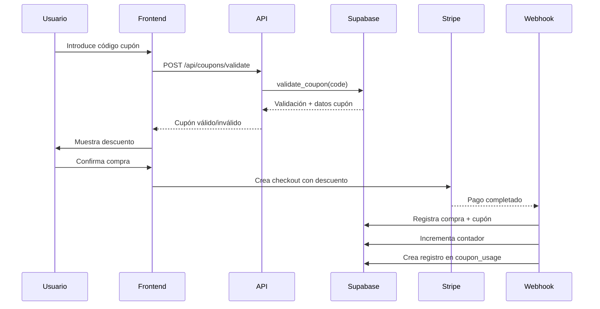

# Sistema de Cupones de Descuento - Hakadogs

Sistema completo de cupones para colaboraciones con veterinarios, tiendas de mascotas y otras entidades.

## 📋 Características

### ✅ Funcionalidades Implementadas

- **Gestión de Cupones (Admin)**
  - Crear, editar y eliminar cupones
  - Códigos personalizados (ej: "JACA26")
  - Porcentaje de descuento configurable (0-100%)
  - Nombre del colaborador/partner
  - Descripción interna
  - Límite de usos (ilimitado o número específico)
  - Fechas de validez (inicio y fin)
  - Activar/Desactivar cupones sin eliminarlos

- **Aplicación de Cupones (Usuario)**
  - Campo de cupón en página de compra
  - Validación en tiempo real
  - Aplicar/Quitar cupón antes del pago
  - Vista previa del descuento
  - Mensajes de error claros

- **Integración con Stripe**
  - Precio con descuento aplicado en checkout
  - Metadata del cupón en la transacción
  - Registro automático del uso en webhook

- **Auditoría y Estadísticas**
  - Registro de cada uso de cupón
  - Estadísticas por cupón (usos, descuentos, ingresos)
  - Vista general de todos los cupones
  - Historial de usos por cupón

## 🗂️ Estructura de Base de Datos

### Tabla `coupons`
```sql
- id (UUID)
- code (VARCHAR, UNIQUE) - Código del cupón
- discount_percentage (DECIMAL) - Porcentaje de descuento
- partner_name (VARCHAR) - Nombre del colaborador
- description (TEXT) - Descripción interna
- is_active (BOOLEAN) - Estado activo/inactivo
- usage_limit (INTEGER) - Límite de usos (NULL = ilimitado)
- times_used (INTEGER) - Contador de usos
- valid_from (TIMESTAMP) - Fecha inicio
- valid_until (TIMESTAMP) - Fecha fin (NULL = sin límite)
```

### Tabla `coupon_usage`
```sql
- id (UUID)
- coupon_id (UUID) - Referencia al cupón
- purchase_id (UUID) - Referencia a la compra
- user_id (UUID) - Usuario que usó el cupón
- course_id (UUID) - Curso comprado
- discount_applied (DECIMAL) - Descuento en euros
- original_price (DECIMAL) - Precio original
- final_price (DECIMAL) - Precio final pagado
```

### Columnas añadidas a `course_purchases`
```sql
- coupon_id (UUID) - Cupón usado (si aplica)
- original_price (DECIMAL) - Precio antes del descuento
- discount_applied (DECIMAL) - Descuento aplicado
```

## 🔧 Funciones SQL

### `validate_coupon(p_code, p_user_id)`
Valida si un cupón es válido para usar. Comprueba:
- Que el cupón existe
- Está activo
- Dentro del periodo de validez
- No ha excedido el límite de usos

### `calculate_discounted_price(p_original_price, p_discount_percentage)`
Calcula el precio final después de aplicar el descuento.

### `increment_coupon_usage(p_coupon_id)`
Incrementa el contador de usos de un cupón de forma segura.

## 🔒 Políticas RLS

- **Admins**: Acceso total a gestión de cupones
- **Usuarios autenticados**: Pueden validar cupones activos
- **Auditoría**: Cada usuario puede ver sus propios usos de cupones

## 📊 Vista `coupon_stats`

Vista consolidada con estadísticas por cupón:
- Número de usos reales
- Total de descuentos otorgados
- Ingresos generados con el cupón
- Estado y validez

## 🚀 Uso

### Como Administrador

1. **Crear un cupón**
   - Ir a `/administrator/cupones`
   - Clic en "Crear Cupón"
   - Rellenar formulario:
     - Código (ej: "JACA26")
     - Porcentaje (ej: 15%)
     - Colaborador (ej: "Clínica Veterinaria Jaca")
     - Límite de usos (opcional)
     - Fechas de validez (opcional)

2. **Gestionar cupones existentes**
   - Ver estadísticas de uso
   - Editar cupón
   - Activar/Desactivar
   - Eliminar

### Como Usuario

1. **Aplicar cupón en compra**
   - Ir a página de compra del curso
   - Introducir código en el campo "Cupón de descuento"
   - Clic en "Aplicar"
   - Ver descuento reflejado en el resumen
   - Proceder al pago

## 🔄 Flujo de Aplicación



## 📝 Archivos Modificados/Creados

### Backend
- ✅ `supabase/coupons_system.sql` - Esquema completo
- ✅ `lib/supabase/coupons.ts` - Librería de funciones
- ✅ `app/api/coupons/validate/route.ts` - API de validación
- ✅ `app/api/stripe/create-checkout-session/route.ts` - Modificado
- ✅ `app/api/stripe/webhook/route.ts` - Modificado

### Frontend
- ✅ `app/cursos/comprar/[cursoId]/page.tsx` - Campo de cupón añadido
- ✅ `app/administrator/cupones/page.tsx` - Panel admin
- ✅ `app/administrator/layout.tsx` - Enlace añadido

## 🧪 Testing

### Crear cupones de prueba

```sql
-- Cupón básico
INSERT INTO coupons (code, discount_percentage, partner_name)
VALUES ('TEST10', 10.00, 'Partner Test');

-- Cupón con límite
INSERT INTO coupons (code, discount_percentage, usage_limit)
VALUES ('LIMITED5', 15.00, 5);

-- Cupón con fecha de expiración
INSERT INTO coupons (code, discount_percentage, valid_until)
VALUES ('PROMO20', 20.00, '2026-12-31');
```

### Verificar funcionamiento

1. Crear cupón en admin
2. Ir a página de compra
3. Aplicar cupón
4. Verificar descuento en resumen
5. Completar compra (en modo test de Stripe)
6. Verificar registro en Supabase:
   - `course_purchases` tiene `coupon_id`
   - `coupon_usage` tiene registro
   - `coupons.times_used` incrementado

## 📈 Análisis y Reporting

### Ver rendimiento de cupones

```sql
-- Top 10 cupones más usados
SELECT * FROM coupon_stats 
ORDER BY actual_uses DESC 
LIMIT 10;

-- Cupones por colaborador
SELECT partner_name, COUNT(*), SUM(actual_uses)
FROM coupon_stats
GROUP BY partner_name;

-- Ingresos totales con descuento
SELECT 
  SUM(total_discount_given) as total_descuentos,
  SUM(total_revenue_with_coupon) as ingresos_con_cupones
FROM coupon_stats;
```

## 🔐 Seguridad

- ✅ Validación case-insensitive de códigos
- ✅ Verificación de límites de uso
- ✅ Comprobación de fechas de validez
- ✅ RLS habilitado en todas las tablas
- ✅ Función SECURITY DEFINER para validación
- ✅ Registro único por compra (un cupón por compra)

## 💡 Casos de Uso

1. **Colaboración con veterinarios**
   - Código: "VETALCALA20"
   - Descuento: 20%
   - Partner: "Clínica Veterinaria Alcalá"

2. **Promoción temporal**
   - Código: "VERANO2026"
   - Descuento: 15%
   - Válido: 01/06/2026 - 30/09/2026

3. **Cupón de bienvenida**
   - Código: "BIENVENIDA10"
   - Descuento: 10%
   - Usos ilimitados

4. **Campaña limitada**
   - Código: "BLACK50"
   - Descuento: 50%
   - Límite: 100 usos

## 🆘 Solución de Problemas

### Cupón no se valida
- Verificar que está activo (`is_active = true`)
- Comprobar fechas de validez
- Revisar límite de usos

### Contador no incrementa
- Verificar que el webhook de Stripe está funcionando
- Comprobar logs del webhook
- Función `increment_coupon_usage` debe existir

### Error al crear cupón
- Código debe ser único
- Porcentaje entre 0 y 100
- Solo letras mayúsculas y números en código

## 🚀 Instalación

1. **Ejecutar SQL en Supabase**
   ```bash
   # Ejecutar en SQL Editor de Supabase
   supabase/coupons_system.sql
   ```

2. **Verificar instalación**
   ```sql
   -- Comprobar tablas
   SELECT * FROM coupons LIMIT 1;
   SELECT * FROM coupon_usage LIMIT 1;
   SELECT * FROM coupon_stats LIMIT 1;
   
   -- Comprobar funciones
   SELECT validate_coupon('TEST', NULL);
   ```

3. **Crear primer cupón**
   - Ir a `/administrator/cupones`
   - Crear cupón de prueba
   - Probar en checkout

## 📞 Soporte

Para dudas o problemas:
1. Revisar logs de Supabase
2. Revisar logs de Stripe webhook
3. Comprobar políticas RLS
4. Verificar que las funciones SQL existen

---

**Fecha de implementación**: 04/02/2026
**Versión**: 1.0.0
**Estado**: ✅ Completo y funcional
